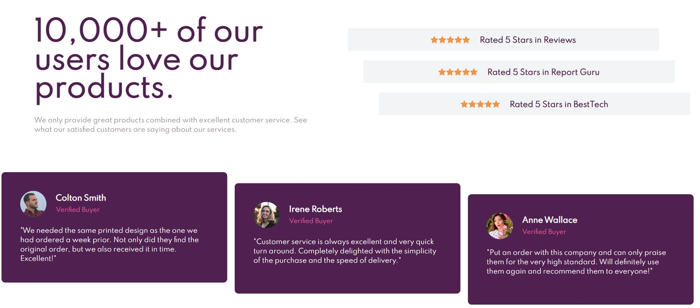
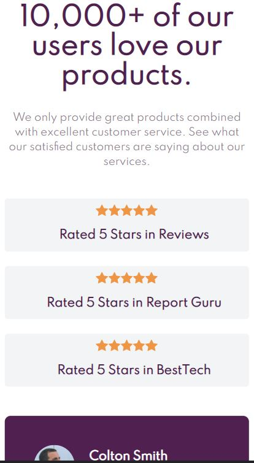

This is a solution to the [Social proof section challenge on Frontend Mentor](https://www.frontendmentor.io/challenges/social-proof-section-6e0qTv_bA). Frontend Mentor challenges help you improve your coding skills by building realistic projects. 

## Table of contents

- [Overview](#overview)
  - [The challenge](#the-challenge)
  - [Screenshot](#screenshot)
  - [Links](#links)
- [My process](#my-process)
  - [Built with](#built-with)
  - [What I learned](#what-i-learned)
  - [Useful resources](#useful-resources)
- [Author](#author)
- [Acknowledgments](#acknowledgments)

## Overview

### The challenge

Users should be able to:

- View the optimal layout for the section depending on their device's screen size

### Screenshot

Desktop

Mobile

### Links

- Solution URL: (https://njabz-1.github.io/Social-proof-section/)
- Live Site URL: (https://njabz-1.github.io/Social-proof-section/)

## My process

### Built with

- Semantic HTML5 markup
- CSS custom properties
- Flexbox
- CSS Grid
- Mobile-first workflow
- [Tailwind](https://tailwindcss.com/) - Helped with mobile responsiveness and styling

### What I learned

- Learnt a bit about how powerful Tailwind can be in projects
- Learnt how to use the > in css for addressing all the child attributes

## Author

Me :)

## Acknowledgments

Shout out to Thomas Sankara (https://www.youtube.com/channel/UCeDWS6WbftXe9-6QQFMrKAQ), helped alot with figuring out how to sort things on a page.

